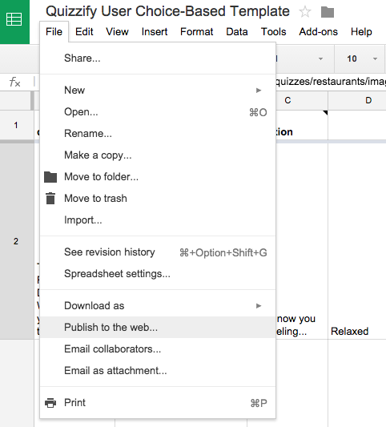
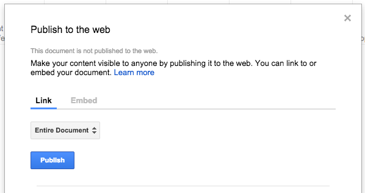
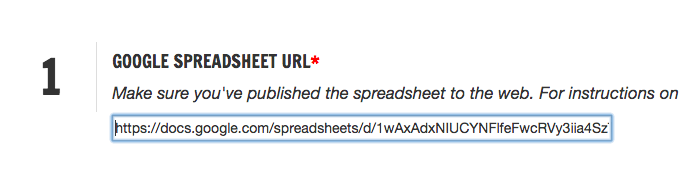

# Quizzify

This is a quiz generator tool built for the Tampa Bay Times. It will help you create an embeddable and responsive quiz that is based off a Google Spreadsheet.

## Examples

There are two types of quizzes you can build using this tool:

- a user choice-based quiz
    + [Tampa Bay Food and Dining Quiz](http://www.tampabay.com/features/food/general/tampa-bay-food-and-dining-quiz-where-should-i-eat-dinner-tonight/2214420)
    + [TBT-o-ween](http://www.tampabay.com/things-to-do/events/tbt-quiz-what-should-your-halloween-costume-be/2203472)
    + [What Thanksgiving dish are you?](http://www.tampabay.com/things-to-do/food/cooking/holiday-quiz-what-thanksgiving-dish-are-you/2207851)
- and a traditional quiz with correct and incorrect answers
    + [A tale of two websites -- Florida CONNECT vs. Healthcare.gov](http://www.tampabay.com/news/perspective/healthcaregov-meet-connect-your-evil-twin-website/2161586)

## Documentation

### Step 1

Make a copy of your desired quiz template.

- [User Choice-Based Quiz Template](https://docs.google.com/spreadsheets/d/1wAxAdxNIUCYNFlfeFwcRVy3iia4SzTCuVifrSuUX3Vo/edit?usp=sharing)
- [Traditional Quiz Template](https://docs.google.com/spreadsheets/d/1Z0eXp1NO2dp42Lb7IUizF7ptXFFnE53gyNyd39S3m8I/edit?usp=sharing)

Fill out the template as you wish. Both templates have notes that describe what should be in each column. I **highly recommend** that you copy these templates because the column headers need to be verbatim.

### Step 2

Once you're done filling out the template, you'll have to make sure to **publish the spreadhseet to web**. To do that, simply navigate to

    File --> Publish to the web...

Make sure `Entire Document` is selected, and click `Publish`.

### Step 3

Once your spreadsheet is published, copy your URL and paste it into Quizzify's first field. *Note: Make sure you're using the latest version of Google Spreadsheets. The URL should look something like docs.google.com/spreadsheets/d/...*

### Step 4

Go through and fill out the rest of the options to produce your desired quiz.

Once you hit submit, the text area at the bottom of the page will return either an iframe or a URL depending on your choice of output in Number 8.

## How to fill out the quiz templates

The quiz template is very finnicky. If your quiz is not loading, chances are you've messed up something on the quiz template. So here are some instructions to help you do it right.

### Traditional Quiz Template

- Col 1: **The title of your quiz**. This will appear as the title of the tab (if your output is a static page), the title of the text (unless you decide to hide the title), and in the Facebook and Twitter share messages.
- Col 2: **A description of the quiz**. This should be relatively short -- one to two sentences and will only be shown in the title field of the quiz (unless you decide to hide the title).
- Col 3: **The type of question**. Two possible values: `tf` (for True or False) and `multiple` (for multiple choice).
- Col 4: **The question**. Pretty self explanatory.
- Col 5: **An image URL**. This field is optional. Insert the URL of an image that you want to appear with the question.
- Col 6: **The source of the image in Col 5**. This field is also optional, but you should probably put credits on your images. Give kudos to your photographers :)
- Col 7: **Multiple choice options**. These fields should only be filled out for `multiple` question types. `tf` will default to show true and false options only.
- Col 8: **The correct answer**. If this is a `multiple` question, put the letter of the answer. If this is a `tf` question, put `True` or `False`.
- Col 9: **An image URL**. Insert the URL of an image that you want to appear with the answer.
- Col 10: **The source of the image in Col 9**. This field is also optional, but once again, it's nice to give photographers credit.
- Col 11: **An explanation with your answer**. This will appear with the correct answer. It can be as long as you want, but I suggest something short and sweet -- less than 7 sentences.
- Col 12: **Sources for your answers**. So people know you're not just making this sh*t up.
- Col 13: **The final image**. Insert the URL of an image that you want to appear with the quiz results.

### User Choice-Based Quiz Template

- Col 1: **The title of your quiz**. This will appear as the title of the tab (if your output is a static page), the title of the text (unless you decide to hide the title), and in the Facebook and Twitter share messages.
- Col 2: **A description of the quiz**. This should be relatively short -- one to two sentences and will only be shown in the title field of the quiz (unless you decide to hide the title).
- Col 3: **The question**. Pretty self explanatory. Although this doesn't have to be a question. It could be a fill in the blank kind of thing like "Right now you are feeling...".
- Col 4-12: **The answer options**. This can be text (ideally something very succinct) or a URL to an image. (You DO NOT need to always have 9 possible answers. If you only want your quiz to have 4, just delete the unnecessary columns. **Delete them off the spreadsheet, do not just clear them.** Make sure there are no blank columns in the middle of the spreadsheet. If you do delete answer columns, make sure to delete their associated image caption, answer bucket and result columns.)
- Col 13-21: **Captions for any images**. This field is optional and should be used if you want to put captions on your images. Images do not need to have captions.
- Col 22-30: **The answer bucket for each option**. The way this quiz works is it counts Answer Buckets to determine the user's results. In a 9 question quiz, if the user chooses one answer bucket more than the others, that is their result. If they choose one of more the same number of times, it will choose alphabetically. These cells need to match **EXACTLY** with the answer columns (see the next bullet). They are case sensitive. I recommend copying the names of the answer columns and copying and pasting them into the Answer Buckets.
- Col 31-39: **The results and their explanations**. The names of these columns will change with every quiz. The names of the columns should match what you want to appear in the result popup. *Example:* "You got: Red Mesa Mercado!" should have "Red Mesa Mercado" as the column name. The ordering of these result columns does not matter. You should only fill out the first two or three rows for these columns.
    + The first row should contain **the URL to an image** that you want to appear with the result.
    + The second row should contain **the explanation text** for the result. This field is HTML friendly.
    + The third row is optional and should *only be filled out if you have HTML in the second row*. This row should contain **the explanation text MINUS any added HTML.** This is what will appear in the Facebook post associated with this answer. Any HTML in this field will yield an error in Facebook's share tool.

## Dependencies

You don't need to worry about these dependencies, all of them are shipped with the quiz. I've only written this for anyone who is curious on how the tool works.

- [jQuery](http://jquery.com/)
- [Miso Project's Dataset](http://misoproject.com/dataset/)
- [Google Spreadsheets](http://docs.google.com/spreadsheets/)
- [Bootstrap](http://getbootstrap.com/)

## Credits

Hi, I'm [Alex](http://www.alexisnsanchez.com). I'm a front-end developer at the [Tampa Bay Times](http://www.tampabay.com).
